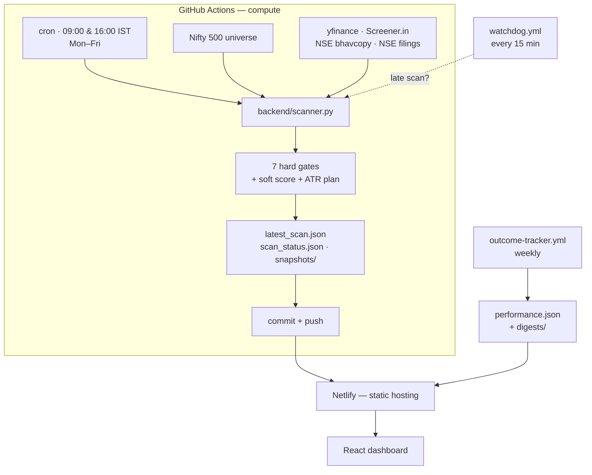

<div align="center">

# NSE Swing Scanner

**A zero-cost, serverless swing-trade screener for the NSE.**
Seven fail-closed hard gates, one transparent score, and a public track record
that grades the system's own past picks.

[](https://github.com/amitashwinibhagat/nse-swing-scanner/actions/workflows/ci.yml)
[](LICENSE)
[](https://www.python.org/)
[](https://react.dev/)
[](https://vitejs.dev/)
[](https://nse-swing-scanner.netlify.app)
[](CONTRIBUTING.md)
[](https://dodo.pe/amitash)

[](#disclaimer)
[](#disclaimer)

**[Live dashboard](https://nse-swing-scanner.netlify.app)** ·
[Methodology](docs/methodology.md) ·
[Changelog](CHANGELOG.md) ·
[Contributing](CONTRIBUTING.md) ·
[Security](SECURITY.md)

</div>

---

NSE Swing Scanner runs twice a day on GitHub Actions, screens the **Nifty 500**
against seven hard gates and a soft ranking score, and commits the result as
static JSON. A React dashboard reads that JSON from a CDN. There is no server to
run, no database, no auth, and nothing to pay for — free data sources and free
tiers the whole way down.

It is **not** a black box. Every gate fails closed when a source is unreachable,
every row carries a source-status tag, and a weekly outcome tracker publishes the
forward returns of the system's own past calls — including the bands that *don't*
work.

<div align="center">

> **Reliability note:** GitHub Actions scheduled workflows are **best-effort** and
> have been observed to drift hours late or be dropped entirely during runner
> incidents. The 16:00 IST cron on 2026-07-03 did not fire at all.
> See [Monitoring](#monitoring-healthchecksio--watchdog) for the alerting and
> self-recovery layer.

</div>

## Table of contents

- [Why this architecture](#why-this-architecture-read-before-changing-it)
- [Features](#features)
- [How it works](#how-it-works)
- [The seven hard gates](#the-seven-hard-gates)
- [Track record](#track-record)
- [Quick start](#quick-start)
- [Configuration & secrets](#configuration--secrets)
- [Monitoring (healthchecks.io + watchdog)](#monitoring-healthchecksio--watchdog)
- [Local development](#local-development)
- [Project layout](#project-layout)
- [Testing](#testing)
- [Limitations](#limitations-read-this)
- [Tech stack](#tech-stack)
- [Support this project](#support-this-project)
- [License](#license)

---

## Why this architecture (read before changing it)

Netlify Functions **cannot run the actual scan.** Verified against Netlify's
current docs: synchronous functions cap at 60 seconds, scheduled functions at 30
seconds, and even background functions top out at 15 minutes with no persistent
process support. A full Nifty 500 scan takes far longer than that, thanks to
per-symbol fetches and rate-limit courtesy sleeps — past even the most permissive
Netlify function type.

So the system is split by what each platform is genuinely good at:

| Layer | Runs on | Why |
|---|---|---|
| **Compute** — the scan | **GitHub Actions** | A normal long-lived CI job with no serverless timeout. Free for public repos. |
| **Serving** — the dashboard | **Netlify** | Static hosting, auto-deploy on git push, global CDN, zero config. |

The two meet at the simplest possible contract: GitHub Actions writes
`frontend/public/data/latest_scan.json` and commits it. Netlify rebuilds on that
push. The React app fetches a static JSON file — no API layer, no database, no auth.

## Features

- **Seven hard gates, fail-closed.** An unreachable source fails a gate rather
  than silently passing it. No phantom candidates.
- **A transparent soft score.** Seven named sub-scores blended into 0–100, with a
  relative-strength multiplier vs the Nifty 50. Every component is visible.
- **Decision-complete cards.** Each pick leads with the action, the ATR-based
  buy zone, the stop, two targets, the per-share risk, and a share-count preview.
- **A public track record.** A weekly outcome tracker computes T+5 / T+10 / T+20
  forward returns of past cohorts vs the index, with bootstrap confidence
  intervals. Weak bands are demoted and labelled, never hidden.
- **Scan history.** Dated snapshots and a "what changed since last scan" diff.
- **Personal watchlist and local trade journal.** Everything stays in
  `localStorage` — no account, no server, nothing uploaded.
- **Source-status transparency.** Every external fetch reports `ok`, `missing`,
  `source_failed`, `fallback_used`, or `flag_only`, surfaced per row in the UI.
- **Self-recovery.** A watchdog plus healthchecks.io detect cron drift and
  re-trigger missed scans automatically.
- **$0 to run.** Free data, free CI, free hosting. No always-on server.

## How it works



**The scan, step by step:**

1. Fetch the universe (Nifty 500), the surveillance list, and the bhavcopy.
2. Compute market context (Nifty 50 vs its 200-day EMA) and per-stock technicals.
3. Evaluate each name against the seven hard gates, then score the survivors.
4. Refuse to publish below 85% price coverage — a half-blind scan exits `2` and
   keeps the last good JSON, so the dashboard never shows a partial PASS list.
5. Commit `latest_scan.json`, `scan_status.json`, and a dated snapshot.
6. Once a week, the outcome tracker scores past cohorts and commits
   `performance.json`.

## The seven hard gates

All gates are implemented and **fail closed** — if a source is unreachable, the
row fails that gate rather than passing it silently.

| Gate | Criterion | Source |
|---|---|---|
| **F-Score** | Piotroski F-Score ≥ 6 (configurable; spec is > 7) | yfinance financials |
| **Drawdown** | −40% ≤ % off 52-week high ≤ −15% | yfinance |
| **RSI** | 25 ≤ RSI(14) ≤ 40 | yfinance |
| **Liquidity adequacy** | real NSE delivery ≥ ₹5 cr **or** 20-day ADV ≥ ₹10 cr | NSE bhavcopy (preferred) / yfinance ADV |
| **T-group / suspension** | not in T-group, GSM, or suspension | NSE → BSE → flag-only |
| **Holdings conviction** | promoter + FII + DII > 50% | Screener.in |
| **Pending corporate actions** | no excluded action in the next 30 days | NSE corporate actions |

Survivors get a soft 0–100 score from seven sub-scores (valuation, RSI, EMA,
drawdown, volume, F-Score, holdings) plus a relative-strength-vs-Nifty-50
multiplier, and an ATR(14)-based entry zone, stop, and two targets.

See [`docs/methodology.md`](docs/methodology.md) for the full formula, weights,
and the source-status policy.

## Track record

The moat is not the gates — a neighbour could copy those. It is the
**self-auditing history**. A weekly job replays every past snapshot's gate-passed
cohort and measures forward excess return vs `^NSEI`, per score band and per
market regime, with bootstrap confidence intervals. The dashboard renders these
tables directly from `performance.json`, and the copy mirrors the tracker — no
number is ever hardcoded.

What that discipline buys you:

- Cohorts are **never pooled** across overlapping windows (they are
  autocorrelated) — each snapshot is measured on its own.
- Bands whose confidence interval straddles zero are shown as *not established*,
  not spun as an edge.
- A band that underperforms is labelled as such. The dashboard says so on the
  card, not in a footnote.
- Untrackable symbols are counted and shown, never silently dropped.

Open the **[live dashboard](https://nse-swing-scanner.netlify.app)** and expand
*Methodology & track record* for the current numbers.

## Quick start

### 1. Push this to a GitHub repo

```bash
git init
git add .
git commit -m "Initial commit"
git remote add origin <your-repo-url>
git push -u origin main
```

No secrets or tokens are needed for the scan Action — it commits back using the
automatically provided `GITHUB_TOKEN`, wired in `.github/workflows/scan.yml` via
`permissions: contents: write`.

### 2. Verify the scan Action runs

Go to **Actions → NSE Swing Scan → Run workflow** for a manual trigger. The first
run is cold-cache and slow; subsequent runs are much faster thanks to on-disk
caching. Confirm that `frontend/public/data/latest_scan.json` is committed
afterward.

### 3. Verify CI passes

The `CI` workflow runs backend pytest, a small smoke scan, and a frontend build
on every push and PR. Both jobs must be green before merging.

### 4. Connect the repo to Netlify

- **New site from Git** → pick this repo.
- Netlify auto-detects `netlify.toml` (base `frontend`, build `npm run build`,
  publish `frontend/dist`).
- Deploy. No environment variables are required for the basic setup.

### 5. Confirm the schedule

Cron in `scan.yml` is **09:00 and 16:00 IST on weekdays** (UTC `30 3 * * 1-5` and
`30 10 * * 1-5`). GitHub Actions cron is best-effort and can drift — treat these
as "approximately." The *Last scan* KPI shows the relative age and a drift
indicator so slippage is visible at a glance.

### 6. (Optional) Owner-only on-demand scan trigger

The dashboard exposes a hidden **Run scan now** button when the URL contains
`?admin=1` (e.g. `https://nse-swing-scanner.netlify.app/?admin=1`). It calls a
server-side Netlify Function that proxies GitHub's `workflow_dispatch` endpoint,
so the GitHub PAT never ships to the browser.

Required **Netlify** env vars (Site settings → Environment variables):

| Var | Purpose |
|---|---|
| `SCAN_TRIGGER_SECRET` | Random 32-byte hex passphrase the browser sends as a bearer token. Prompted once and stored in `localStorage`. |
| `GITHUB_DISPATCH_TOKEN` | Fine-grained GitHub PAT scoped to this repo with **Actions: read and write**. Classic PATs with `repo` scope also work. |

Generate a passphrase locally:

```bash
openssl rand -hex 32
```

Behavior: the first click prompts for `SCAN_TRIGGER_SECRET`, then stores it
locally; a 10-minute client-side cooldown disables the button after each
successful trigger, and a *Forget admin secret* link clears `localStorage`.
Refreshing the page never triggers a scan — only the button does. Duplicate
triggers queue rather than cancel a running scan
(`concurrency.cancel-in-progress: false`).

## Configuration & secrets

### GitHub repo secrets

| Secret | Used by | Purpose |
|---|---|---|
| `HEALTHCHECK_PING_URL_MORNING` | `scan.yml` | healthchecks.io ping for the 09:00 IST slot |
| `HEALTHCHECK_PING_URL_EVENING` | `scan.yml` | healthchecks.io ping for the 16:00 IST slot |
| `HEALTHCHECK_PING_URL_CANCELLED` | `scan.yml` | `/fail` ping when a scheduled run is cancelled |
| `HEALTHCHECK_WATCHDOG_URL` | `watchdog.yml` | Watchdog heartbeat |
| `NETLIFY_AUTH_TOKEN` | `scan.yml` | Optional Netlify deploy trigger |
| `NETLIFY_SITE_ID` | `scan.yml` | Netlify site ID for the above |
| `TELEGRAM_BOT_TOKEN` | `scan.yml` | Optional post-scan digest |
| `TELEGRAM_CHAT_ID` | `scan.yml` | Optional post-scan digest target |

Absent optional secrets turn the corresponding step into a logged no-op.

### tunable thresholds

Every gate threshold and cache TTL lives in
[`backend/settings.py`](backend/settings.py) — a single source of truth. Extend a
gate by adding the constant and the gate function **together**; the project's
rule is *no new hard gates until the existing ones are validated.*

## Monitoring (healthchecks.io + watchdog)

Because GitHub Actions cron is best-effort, two complementary mechanisms
backstop the schedule.

### healthchecks.io pings

`scan.yml` pings one of two URLs (one per slot) at three points:

| Step | URL | When |
|---|---|---|
| Scan started | `{URL}/start` | First step (after checkout) |
| Scan failed | `{URL}/fail` | Any step in the job failed |
| Scan succeeded | `{URL}` | Job completed cleanly |

`github.event.schedule` tells the workflow which cron fired, so it picks the
morning or evening URL automatically. The cancelled-run case pings its own
dedicated URL. Absent secrets make these no-ops.

**One-time setup:** sign up at <https://healthchecks.io> (free tier), create two
checks for the scan slots (grace 4 h) plus one for the watchdog
(period 1 h, grace 1 h), then set the matching GitHub secrets listed above.

### Watchdog workflow

`watchdog.yml` runs every 15 minutes during market hours and:

- Treats a scan as *late* only past the next scheduled window plus a 30-minute
  grace period (weekend-aware).
- Fires `gh workflow run scan.yml` **only if** no scan run is queued or in-flight
  **and** its own 45-minute cooldown has expired. This dedup means one drifted
  scan triggers at most one recovery run.
- Pings its own healthchecks URL with `?stale=...&age_min=...&run_state=...` so
  alerts carry context.

### Manual recovery

If you get alerted, open **Actions → NSE Swing Scan → Run workflow** to trigger
immediately. A warm-cache recovery scan is quick.

> **Why not a paid cron service?** You can swap the watchdog for cron-job.org,
> EasyCron, GitLab CI scheduled pipelines, or anything that POSTs to GitHub's
> `/repos/{owner}/{repo}/dispatches` endpoint. The current stack is free and uses
> infrastructure you already own.

## Local development

```bash
# Backend — generate a sample scan for frontend dev
cd backend
python3 -m venv .venv
.venv/bin/pip install -r requirements.txt
.venv/bin/python scanner.py --sample 20 --output ../frontend/public/data/latest_scan.json

# Backend tests
.venv/bin/pytest -q

# Frontend
cd ../frontend
npm install
npm run dev   # http://localhost:5173
```

The frontend reads `/data/latest_scan.json` from the public dir, so refreshing the
dev server picks up backend changes. Build with `npm run build`.

## Project layout

```text
.
├── .github/workflows/
│   ├── scan.yml              # twice-daily scan → JSON → commit → deploy
│   ├── watchdog.yml          # 15-min freshness check + auto-recovery
│   ├── outcome-tracker.yml   # weekly forward-return attribution
│   └── ci.yml                # push/PR gate: pytest + smoke scan + build
├── backend/
│   ├── scanner.py            # entry point: orchestrates the whole scan
│   ├── settings.py           # all thresholds + cache TTLs (single source)
│   ├── technicals.py         # RSI, ATR, EMAs, 200EMA proximity
│   ├── fscore.py             # Piotroski F-Score + 5Y average P/E
│   ├── bhavcopy.py           # delivery data: NSE → yfinance proxy → BSE
│   ├── holdings.py           # Screener.in shareholding scraper
│   ├── surveillance.py       # T-group / GSM / suspension
│   ├── corporate_actions.py  # NSE corporate-actions window
│   ├── performance.py        # forward returns + bootstrap CIs
│   ├── scripts/              # snapshot writer, digest, feedback, watchdog
│   └── tests/                # pytest suite
├── frontend/
│   ├── src/                  # React dashboard (components + pure utils)
│   ├── public/data/          # committed scan output (JSON the app reads)
│   └── netlify/functions/    # owner-only trigger-scan function
├── docs/
│   ├── methodology.md        # full scoring formula + assumptions
│   └── analytics.md          # north-star metric + decision log
└── netlify.toml              # build config + cache-control headers
```

## Testing

```bash
cd backend
.venv/bin/python scripts/check_cron_consistency.py   # CI guard: cron windows
.venv/bin/python scripts/check_workflow_scripts.py   # CI guard: script imports
.venv/bin/python -m pytest -q                        # full suite
cd ../frontend && npm run build                      # bundle
```

The suite runs in roughly a second and covers the RSI/ATR math, the bhavcopy
provider chain, cache read/write/expiry, schedule maths, the watchdog dedup
decision, the JSON contract, and the bootstrap-CI statistics.

## Limitations (read this)

- **Free data is fragile.** NSE, BSE, and Screener.in publish no stable public
  APIs. If a source changes shape, the scanner reports `source_failed` or
  `flag_only` and the dependent gate fails closed rather than crashing.
- **NSE bhavcopy is blocked behind Akamai.** The scanner therefore gates on
  *liquidity adequacy*: real delivery ≥ ₹5 cr **or** 20-day ADV ≥ ₹10 cr from
  yfinance. The single-day traded-value proxy (volume × close) is shown for
  transparency but is **not** eligible to satisfy the gate on its own.
- **ADR-listed names** (INFY, WIPRO, IBN, HDB, RDY, …) hit a known yfinance bug
  where diluted EPS is in USD while the price is in INR. `fscore.py` cross-checks
  and blanks the P/E when they diverge — that is the system working, not a bug.
- **Trailing-NaN rows** in yfinance feeds are dropped; the last complete session
  is used as the "current" reference.
- **Earnings surprise is not a hard gate.** There is no clean free source for
  Indian consensus estimates, so the scanner does not pretend to screen on it.
- **Soft-score weights are hand-tuned, not backtested.** Treat the score as a
  degree-of-match ranking, not a strategy signal. The weekly feedback report
  exists to move this toward evidence, not vibes.
- **Not real-time.** The scan runs twice daily; data is stale within hours of a
  market session.
- **Cron drift** is real and mitigated, not eliminated — see Monitoring above.

Also see [`docs/methodology.md`](docs/methodology.md) and the
[CHANGELOG](CHANGELOG.md) for the full history of decisions and known issues.

## Tech stack

| Layer | Choice | Why |
|---|---|---|
| Scanner | Python 3.11 | yfinance / pandas / numpy ecosystem |
| HTTP | `requests` + a custom session | Simple, no extra deps |
| Frontend | React 18 + Vite 8 | Smallest bundle; no SSR needed for static data |
| Hosting | Netlify free tier | $0, auto-deploy on push, global CDN |
| CI/CD | GitHub Actions | Free for public repos; runs both the scan and the tests |
| Monitoring | healthchecks.io free tier | Cron-drift alerting |

## Disclaimer

> **Not investment advice. Not SEBI-registered research.** This is an
> experimental screening tool. Every candidate must be cross-checked against
> authoritative sources — Screener.in, NSE filings, a SEBI-registered advisor —
> before you act on it. Data comes from free, best-effort sources and may be
> incomplete or stale. You are responsible for your own decisions.

## Support this project

NSE Swing Scanner is free and open source, with no ads, no tracking, and no
paid tier. It costs nothing to use and — thanks to free tiers — almost nothing
to run. If it saves you time, you can support its continued development:

<div align="center">

### [Sponsor / donate via Dodo Payments](https://dodo.pe/amitash)

**[https://dodo.pe/amitash](https://dodo.pe/amitash)**

Every contribution goes toward keeping the data fresh, the tests green, and the
project free for everyone.

</div>

Other ways to help that cost nothing: star the repo, report a bug, improve the
docs, or send a pull request. See [CONTRIBUTING.md](CONTRIBUTING.md).

## License

MIT — see [LICENSE](LICENSE).

<div align="center">

An experimental product of **[DataDab LLP](https://www.datadab.com)**.

</div>
